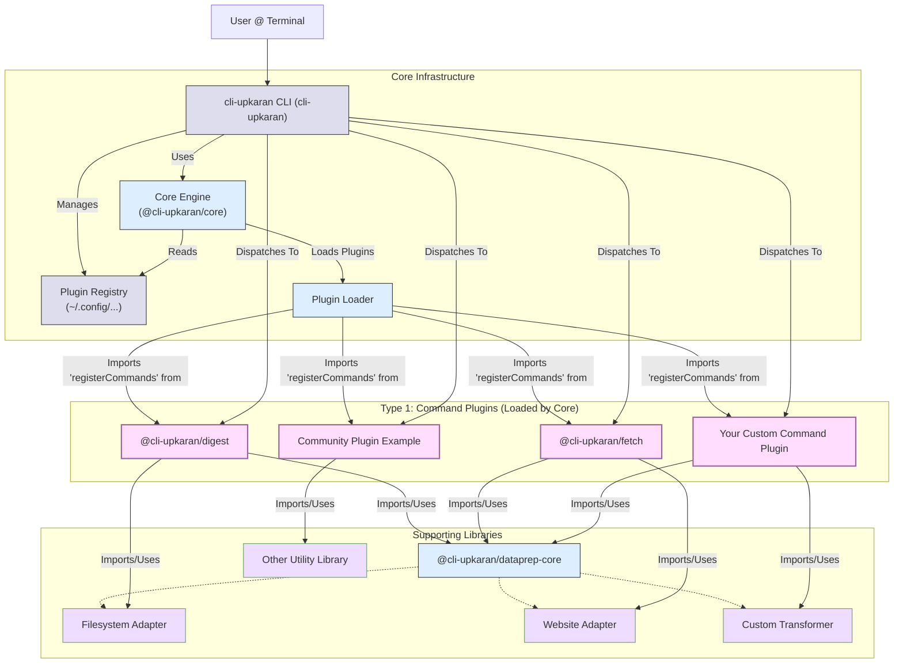

# cli-upkaran: Extensible CLI Toolkit

[](https://opensource.org/licenses/MIT)
<!-- Add other badges here: Build Status, npm version, etc. -->
<!-- e.g., [](https://github.com/mahesh-hegde/cli-upkaran/actions/workflows/ci.yml) -->
<!-- e.g., [](https://badge.fury.io/js/%40cli-upkaran%2Fcli) -->

`cli-upkaran` (Upkaran meaning "Tools" or "Instruments" in Hindi) is a modular and extensible command-line interface designed to streamline development workflows. It provides a core foundation and allows extending its capabilities through a simple plugin system.

Built with TypeScript and using pnpm workspaces for monorepo management.

## Architecture Overview

The `cli-upkaran` toolkit follows a modular architecture designed for extensibility. The core platform loads pluggable tools (commands) based on a user-managed registry, and these tools can leverage shared supporting libraries like data preparation components.



**Key Extension Points:**

1.  **Command Plugins:** The primary way to add functionality. Create separate npm packages exporting a `registerCommands` function. Users install these via the `cli-upkaran plugins add` command, adding them to the registry for the core engine to load.
2.  **Supporting Libraries (e.g., Data Prep):** For more complex tasks, command plugins can import and use shared libraries like `@cli-upkaran/dataprep-core`. You can create and publish new adapters or transformers for the data prep system, which command plugins can then depend on.

## Features

*   **Modular Architecture:** Core functionality is kept separate from command implementations, which reside in distinct packages.
*   **Extensible via Plugins:** Easily add new commands by installing or creating plugin packages.
*   **Central Plugin Registry:** Manage installed plugins effortlessly using built-in commands (`plugins list`, `add`, `remove`, `cleanup`). Plugins are stored locally in `~/.config/cli-upkaran/plugins.json`.
*   **Robust Plugin Loading:** Automatically loads registered plugins on startup, handling resolution errors gracefully (tries name then path, skips broken plugins).
*   **Automatic Plugin Installation:** The `plugins add` command can validate, prompt, and install missing plugins from npm using the `--install` flag.
*   **Namespace Resolution:** Prevents command name collisions between plugins by using qualified names (`<packageName>:<commandName>`).
*   **Interactive Mode (Optional):** Provides an interactive prompt for discovering and running commands if no specific command is provided on the command line (if implemented).
*   **Global Options:** Control verbosity (`--verbose`) and color output (`--no-color`). Override loaded plugins (`--plugin`).
*   **Automated Versioning & Releases:** Uses [Changesets](https://github.com/changesets/changesets) and GitHub Actions for automated version bumping, changelog generation, and publishing (including pre-releases).

## Installation

**Prerequisites:**

*   Node.js (v20 or higher recommended)
*   pnpm (v9 or higher recommended)

Install the main CLI package globally using npm (or pnpm):

```bash
# Using npm
npm install -g cli-upkaran 

# OR Using pnpm
pnpm add -g cli-upkaran
```

*(Note: Verify `cli-upkaran` is the correct published package name if it differs.)*

This will make the `cli-upkaran` command available in your terminal.

## Usage

### Running Locally (During Development)

When working within the monorepo, use `pnpm exec` from the root directory to run your local development version:

```bash
pnpm exec cli-upkaran <command> [options...]

# Example:
pnpm exec cli-upkaran plugins list
```

Alternatively, add a script to the root `package.json`:

```json
// package.json
"scripts": {
  // ...
  "cli": "cli-upkaran"
}
```

And run via:

```bash
pnpm run cli <command> [options...]
```

### Running Installed Version

Once installed globally, you can run commands directly:

```bash
# Run a command from a specific plugin package
cli-upkaran @cli-upkaran/fetch:fetch --help

# Run a command from another registered plugin
cli-upkaran some-other-plugin:do-thing --input data.json
```

### Global Options

These options can be used with any command:

*   `--verbose`: Enable detailed logging output for debugging.
*   `--no-color`: Disable colored output in the terminal.
*   `--plugin <path_or_name>`: Load *only* the specified plugin(s) for this execution, overriding the registry. Can be specified multiple times. Useful for testing local plugins. If the plugin isn't installed, you'll be prompted to install it (checks npm).

## Plugin Management

`cli-upkaran` uses a central registry (`~/.config/cli-upkaran/plugins.json`) to keep track of your installed plugins. Manage this registry using the `cli-upkaran plugins` commands.

**1. Listing Registered Plugins:**

```bash
cli-upkaran plugins list
# Alias: cli-upkaran plugins ls
```

**2. Adding / Registering a Plugin:**

```bash
# Add a plugin by package name (checks if installed first)
cli-upkaran plugins add <plugin-package-name>

# Add a specific version/tag (checks if installed first)
cli-upkaran plugins add <plugin-package-name>@<version_or_tag>

# Add and attempt to install if not found (prompts if available on npm)
cli-upkaran plugins add <plugin-package-name>[@version] --install

# Add a plugin from a local path (useful for development)
cli-upkaran plugins add /path/to/my/local-plugin
```

*   The `add` command validates the input.
*   It tries to resolve the plugin locally first.
*   If not found and `--install` is used, it checks npm, prompts for confirmation, installs globally, then registers.
*   The registry stores the name you provided and the successfully resolved absolute path.

**3. Removing / Unregistering a Plugin:**

```bash
cli-upkaran plugins remove <plugin-package-name>
# Alias: cli-upkaran plugins rm <plugin-package-name>
```

*   Removes the plugin entry from the registry file.
*   Does **not** uninstall the package from your system.

**4. Cleaning Up Broken Plugins:**

```bash
cli-upkaran plugins cleanup
```

*   Checks if all registered plugins can still be resolved (by name or stored path).
*   Lists any plugins that cannot be found.
*   Prompts for confirmation before removing the broken entries from the registry.

## Developing Plugins

Create your own commands by building a Node.js package that exports a registration function.

1.  **Create Package:** Standard Node.js package setup.
2.  **Add Core Dependency:** Add `@cli-upkaran/core` as a dependency.
3.  **Implement Commands:** Define command logic and create definitions using the `CommandDefinition` interface (`name`, `description`, `aliases?`, `configure?`, `handler`).
4.  **Export `registerCommands`:** Your package's main entry point must export `registerCommands: RegisterCommandsFn`. This function returns a `CommandPlugin` object (or an array of them).

    ```typescript
    // Example plugin index.ts
    import type { Command } from 'commander';
    import type { CommandDefinition, CommandPlugin, RegisterCommandsFn } from '@cli-upkaran/core';

    const myHandler = async (options: any, command: Command): Promise<void> => { /* ... */ };

    const myCommandDef: CommandDefinition = {
      name: 'my-command',
      description: 'Does something amazing',
      handler: myHandler,
    };

    export const registerCommands: RegisterCommandsFn = () => {
      return {
        type: 'command',
        commands: [myCommandDef],
      };
    };
    ```
5.  **Testing Locally:**
    *   Use the `--plugin` flag with a relative or absolute path:
        ```bash
        # From monorepo root
        pnpm exec cli-upkaran --plugin ./packages/my-local-plugin --verbose my-local-plugin:my-command
        ```
    *   Or, register the local path using `plugins add`:
        ```bash
        pnpm exec cli-upkaran plugins add ./packages/my-local-plugin
        pnpm exec cli-upkaran my-local-plugin:my-command
        ```

*Refer to existing packages like `@cli-upkaran/digest` or `@cli-upkaran/command-fetch` for concrete examples.*

## Versioning and Releases

This project uses **Changesets** for version management and changelog generation, integrated with GitHub Actions for automation.

*   **Developers:** Use `pnpm changeset` after making changes to document the intent for version bumps and provide changelog summaries.
*   **Automation:** Merging PRs with changesets into `main` triggers workflows that version packages, update changelogs, publish to npm, and create Git tags.
*   **Pre-Releases:** Supports `alpha`/`beta`/`rc` workflows via `pnpm changeset pre enter/exit`.

**For detailed steps on the release workflow (including pre-releases), please see:**

➡️ **[Release Workflow Documentation](docs/release-workflow.md)**

## Contributing

Contributions are welcome! Please refer to the `CONTRIBUTING.md` file (if it exists) for guidelines on how to contribute, report issues, and set up your development environment.

## License

This project is licensed under the [MIT License](LICENSE).
<!-- Make sure to add a LICENSE file with the MIT license text -->
